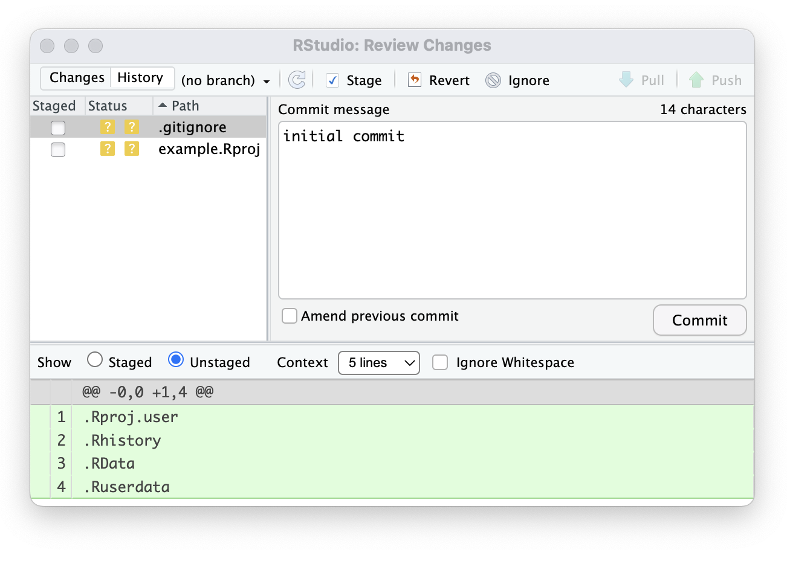



## Let's Git started

To start, we're going to work with Git entirely separate from R and R Studio, at least initially. The purpose of this is two-fold: 1. Git is relevant way beyond just R as a programming language 2. It's easier to learn the machinations of Git without having to simultaenously learn the ins and outs of RStudio's Git interface!

To do this, we'll be working in the terminal *within* RStudio. I'm doing things this way so that we're all working with the same software, rather than having to navigate the intracacies of how different CLIs (command-line interfaces) operate on different operating systems!

## Standing up a Git repo using the command line interface (CLI)

### Step 1: Install Git & Verify

#### Installation

-   **macOS:** Open Terminal and type `git --version` (macOS will prompt you to install Xcode Command Line Tools if not installed), or use Homebrew: `brew install git`.
-   **Windows:** Download and run the installer from [git-scm.com](https://git-scm.com/install/windows) (includes **Git Bash**, a Linux-like terminal).
-   **Linux (Ubuntu/Debian):** Run `sudo apt update && sudo apt install git`.

#### Check Installation

Open your terminal within R Studio and verify Git is ready:

``` bash
git --version
# Example output: git version 2.45.0
```

------------------------------------------------------------------------

### Step 2: Configure Your Identity

Before making commits, set your name and email. Git attaches this information to every commit you make.

``` bash
git config --global user.name "Your Name"
git config --global user.email "your.email@example.com"
```

------------------------------------------------------------------------

### Step 3: Create a Project Directory & Initialize Git

1.  Create a new folder for your project and navigate into it:

``` bash
mkdir my-first-repo
cd my-first-repo
```

2.  Initialize a new Git repository in this directory:

``` bash
git init
# Output: Initialized empty Git repository in /path/to/my-first-repo/.git/
```

This tells Git that you want to start tracking all of the versions of files within your current directory. Git will create a few files (these may be hidden in your default file browser) that will build the tracking logs and control which files are or aren't tracked.

------------------------------------------------------------------------

### Step 4: Create a File & Check Status

1.  Create a simple text file:

``` bash
echo "# My First Project" > README.md
```

This will create a markdown document called "README" in your directory, and add one simple line of text to it. 

2.  Check the status of your repository:

``` bash
git status
```

**Output:**

``` text
On branch main

No commits yet

Untracked files:
  (use "git add <file>..." to include in what will be committed)
    README.md

nothing added to commit but untracked files present (use "git add" to track)
```

Notice that `README.md` is **Untracked**. Git sees the file, but it isn't monitoring changes yet. We need to explicitly tell git to do so!

------------------------------------------------------------------------

### Step 5: Stage the File (Add to Index to be tracked)

Move the file to the **Staging Area** using `git add`:

``` bash
git add README.md
```

Check the status again:

``` bash
git status
```

**Output:**

``` text
On branch main

No commits yet

Changes to be committed:
  (use "git rm --cached <file>..." to unstage)
    new file:   README.md
```

The file is now staged and ready to be saved in history!

------------------------------------------------------------------------

### Step 6: Commit the File

Save the staged snapshot to your local Git history with a descriptive message:

``` bash
git commit -m "Initial commit: Add README file"
```

**Output:**

``` text
[main (root-commit) 7a8b9c0] Initial commit: Add README file
 1 file changed, 1 insertion(+)
 create mode 100644 README.md
```

------------------------------------------------------------------------

### Step 7: Modify a File & View Differences

1.  Add a new line to `README.md`:

``` bash
echo "Learning Git via the command line" >> README.md
```

2.  Check what changed using `git diff`:

``` bash
git diff
```

**Output:**

``` diff
diff --git a/README.md b/README.md
index a1b2c3d..e4f5g6h 100644
--- a/README.md
+++ b/README.md
@@ -1 +1,2 @@
 # My First Project
+Learning Git via the command line!
```

------------------------------------------------------------------------

### Step 8: Stage & Commit the Updates

1.  Stage all modified files at once:

``` bash
git add .
```

2.  Commit the new change:

``` bash
git commit -m "Update README with learning goal"
```

------------------------------------------------------------------------

### Step 9: View Your Commit History

Display the history of all commits made in this project:

``` bash
git log --oneline
```

**Output:**

``` text
e4f5g6h (HEAD -> main) Update README with learning goal
7a8b9c0 Initial commit: Add README file
```

------------------------------------------------------------------------

## Experimenting with your code: branching
Let's say you've spent a few weeks working on an analysis and are pretty happy with where things are. You meet with your advisor or collaborators, and they suggest a bunch of ways to adjust your approach or to try different models and visualizations. You could start monkeying with all of your functioning code and trying to implement their suggestions, but if thing's don't pan out or you break things, you may need to revert back to commits far back and history lose a lot of ground. This sort of situation is a great place to use a new **branch** to develop your new ideas/feedback from your colleagues. At their most basic, a **branch** is an independent line of development.

```{.text .bg-light .p-2 .border}
                 feature
                ●──●──●
               /
●──●──●──●──●──●  main
```

Branches let you experiment without immediately changing `main`.

---

### Switch & checkout

To move between branches:

```bash
git switch main
git switch feature
```

Older Git workflows often use:

```bash
git checkout feature
```

The important idea is simple: **switch to the version/line of development you want to work on.**

### Re-combining your work: `merge`

A **merge** combines changes from one branch into another.

```{.text .bg-light .p-2 .border}
feature
   ●──●──●
  /       \
 ●──●──────●  main
```

For example:

```bash
git switch main
git merge feature
```

### Merge conflicts

Sometimes Git cannot automatically reconcile two sets of changes. This is a **merge conflict**. A common example: Two people changed the same line of the same file. Git will ask you to resolve the disagreement manually.

::: {.callout-tip}
Merge conflicts are not Git "breaking". They are Git asking a human to make a decision it cannot safely make automatically to make sure it doesn't royally bungle your project/analyses! 
:::

---

</br>

## Great! Now let's do all of this in RStudio!

The good news is that we almost never have to use Git in the CLI; all modern integrated development environments (IDEs) like RStudio, Positron, and XCode have Git functionality built into them. In RStudio, there are several ways to initiate a Git repo and begin using version control, and we'll go through the two most common methods below.

### I want to start a brand new project, from scratch, and track using Git
This is the easiest way to get Git enabled for your project. Once you boot up RStudio:

1. **Create a project:** go to the <kbd>File</kbd> menu, and click <kbd>New Project...</kbd>, and then select <kbd>New Directory</kbd>, and then finally <kbd>New Project</kbd>
2. **Adjust project details:** enter the name of the folder (directory) you want to create, as well as where you'd like to place it on your computer. 
3. **Enable Git**: Toggle the checkbox that says <kbd>Create a git repository</kbd> and then select <kbd>Create project</kbd>

Voila! RStudio will create the new folder, open it up as a project, and initilzie a git repo, `.gitignore` file, and you're off to the races!

### I want to use an existing project/directory and initialize Git tracking
This is common if you have a project you've been working with, but haven't been using git yet to track your files. The process is a bit different and more laborious as you'll need to stage many more changes right away. 

1. **Open your existing project/directory:** Open your project in RStudio the way you normally would if you were going to work on it
2. **Enable Git:** go to the <kbd>Tools</kbd> menu, and select <kbd>Version control</kbd> --> <kbd>Project setup...</kbd>. Select `git` from the Version Control System dialog box. You can ignore the Origin option. 
3. **Click <kbd>OK</kbd>**

Boom. RStudio will initialize a git repo in your existing project, and you're now able to stage files you want to track, adjust your `.gitignore` file accordingly, and get back to work!

### How to use Git in RStudio
There are, naturally, two main ways you can use Git in RStudio. If you're keen on doing everything using the CLI via the Terminal in RStudio, you can absolutely do that! However, RStudio also has some great point 'n click + visual ways to work with Git and track your files.

You may have noticed that, after your intialized a Git repo in your project (or started a new project with Git), that the GUI changed a bit. You now have a couple of extra pane tabs and dropdown menus:


You can use either of these to jump into the Git dialog box where you can stage changes, view file diffs, write commit messages, push, and pull (we'll get to those last two next week). 



### Give it a go! 
In your project, go ahead and create your directory structure of choice, and create some R scripts that you add some basic code to. Adjust your .gitignore file to ignore things like data folders (you'll also see that RStudio automatically ignores things like `.Rdata` files). Stage those changes and commit away! 